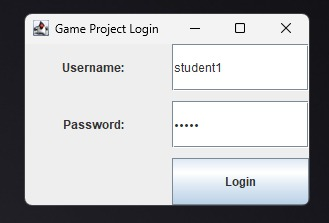
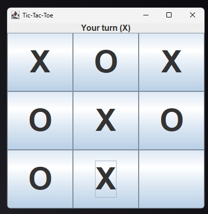
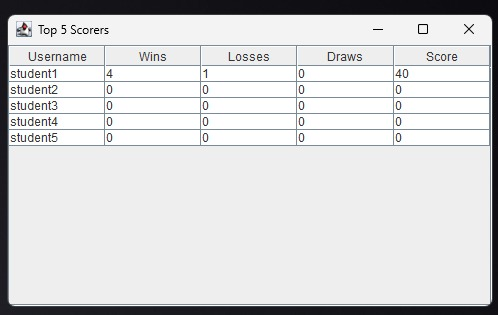

## Simple Tic-Tac-Toe Game with Java Swing, Login, and Statistics

## Student Information
| Student | Information |
| :--- | :--- |
| Name: | Rasya Hafidz Atharachman |
| Student ID: | 5026251031 |
| Class: | A |

## Project Description
This project is a simple Tic-Tac-Toe game built using Java Swing for Programming Fundamental. The application includes database-driven secure login, real-time game statistics tracking, and a Top 5 scorer leaderboard feature. The computer moves randomly based on simple Game Logic arrays.

## Features
- Login using a relational database checking.
- Play Tic-Tac-Toe against the computer using a Java Swing GUI.
- Record match stats correctly (Win = +10, Draw = +3, Lose = +0).
- View personal statistics retrieved safely from the database.
- Display the Top 5 overall scorers using a JTable dynamically loaded from MySQL.

## Database
Database used: MySQL (One table configuration requirement)

## How to Run
- Create the database in MySQL Server named `game_project`;.
- Import `schema.sql` found in the` /database` folder to generate the players table and sample entries.
- Open the Java project in your preferred IDE (IntelliJ IDEA, Eclipse, NetBeans, etc.).
- Add the `mysql-connector-j` (JDBC driver) to your project libraries.
- Configure `DatabaseManager.java` by typing your specific USER and PASSWORD connection credentials.
- Run `Main.java` to launch the Swing application.

## Class Explanation

| Class | Responsibility |
| :--- | :--- |
| `Main` | Starts the application and manages the SwingUtilities.invokeLater thread mapping. |
| `DatabaseManager` | Provides the standardized JDBC MySQL Connection stream across the system. |
| `Player` | Model class — stores player data (id, username, wins, losses, draws, score) |
| `PlayerService` | Executes SQL tasks like validations (login()), leaderboard requests (getTopFives()), and database updating (updateStatistics()). |
| `GameLogic` | Calculates valid movements, array validations, checkWinner() algorithms, and computer generation. |
| `LoginFrame` |Java Swing container rendering the Username/Password security screen. |
| `MainMenuFrame` | Dashboard container enabling navigation to Game, Stats, Leaderboard, or safe Application Exit. |
| `GameFrame` | Swing window for playing Tic-Tac-Toe (3x3 button grid) |
| `StatisticsFrame` | Short-lived window dynamically calling the live player Object to view total score sums. |
| `TopScorersFrame` | Displays playerService.getTopFives() through a DefaultTableModel dynamically placed in a JTable component |

## Screenshots

### 1. Halaman Login

 

### 2. Halaman Game

 

### 3. Halaman Top Scorers

## Video Link
YouTube Demonstration: [[YouTube video link here]](https://youtu.be/lsAXBRpkkIE)
